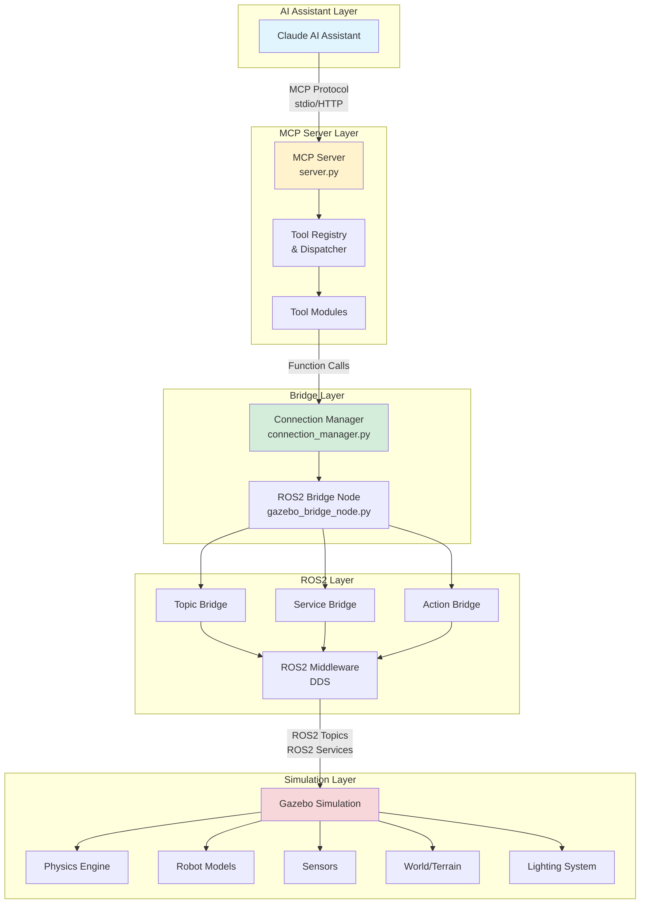
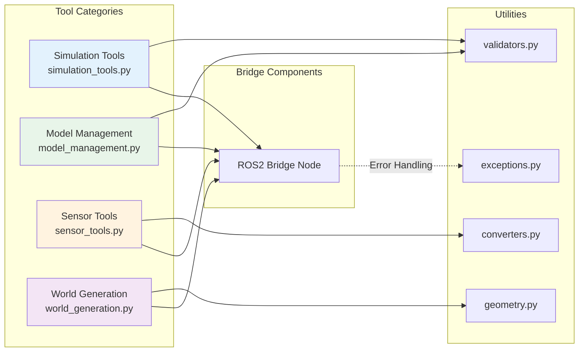
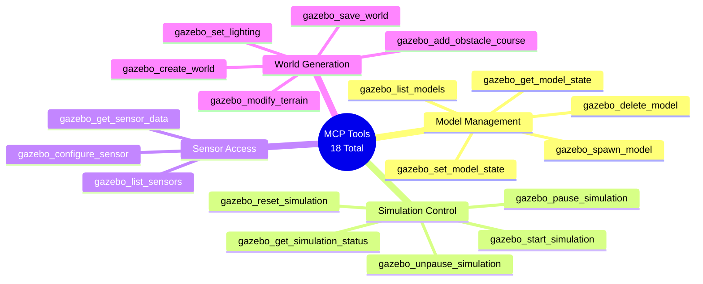
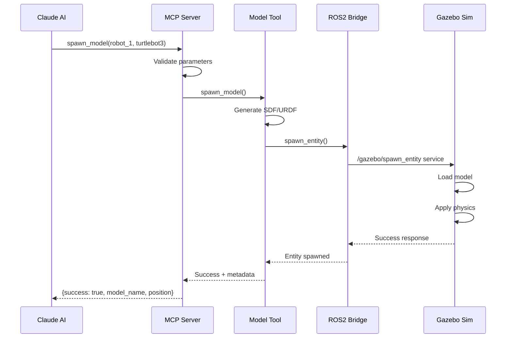
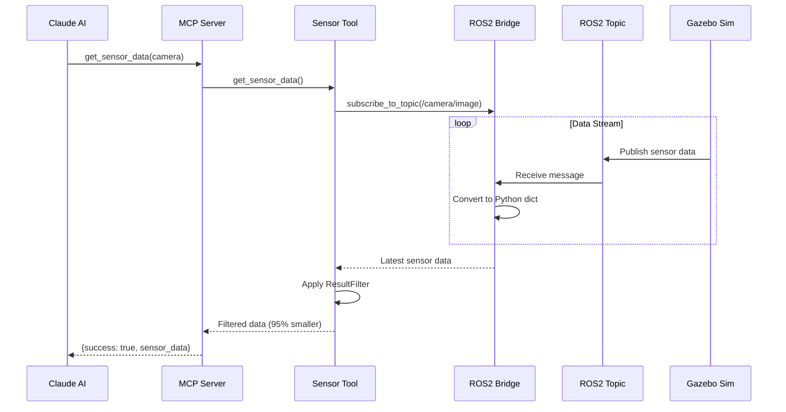
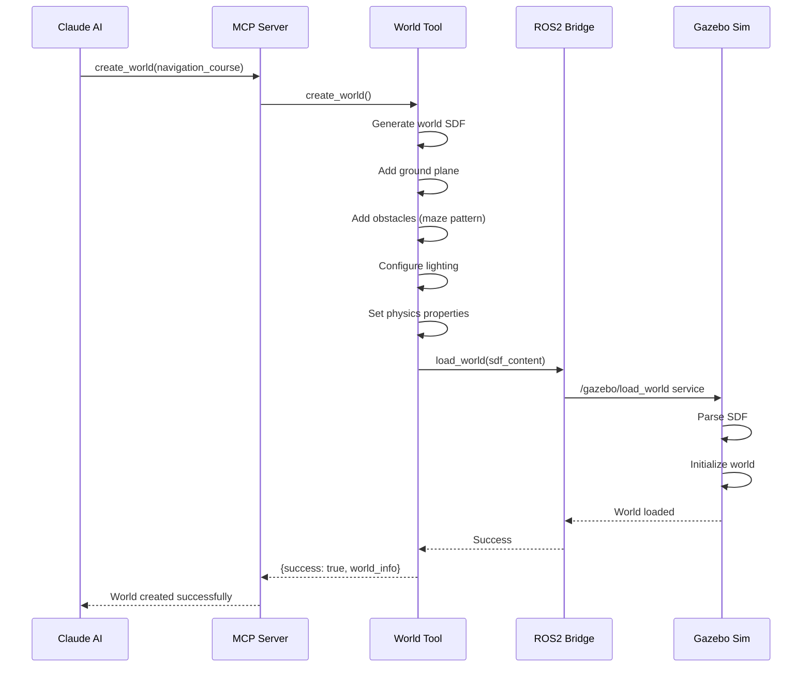
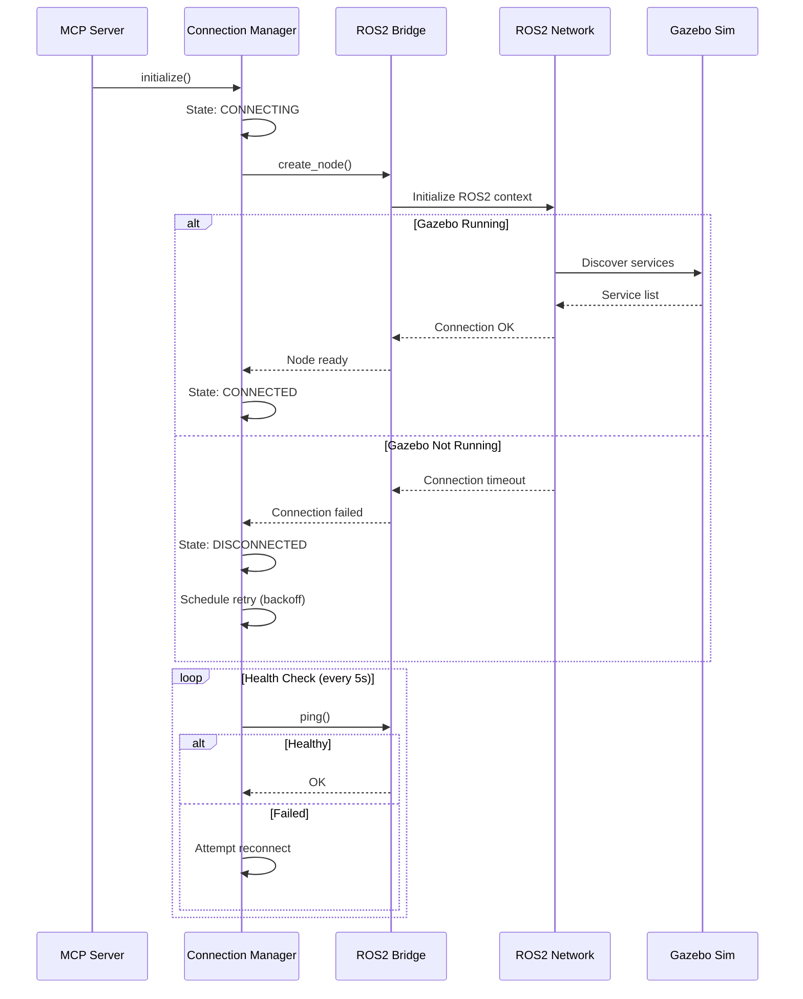
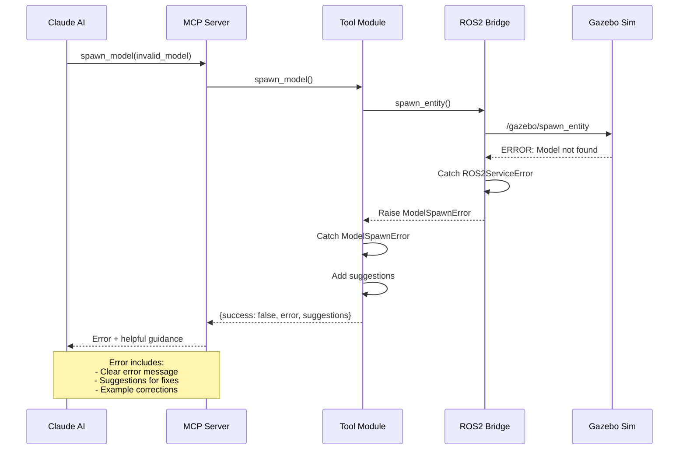

# Gazebo MCP Server Architecture

> **Version**: 1.0 (Production)
> **Last Updated**: 2025-11-16
> **Status**: ✅ Complete Implementation

## Overview

The Gazebo MCP Server provides a Model Context Protocol (MCP) interface for controlling Gazebo simulations through ROS2. It enables AI assistants like Claude to programmatically manage simulations, spawn models, query sensors, and control simulation state with 95-99% token efficiency.

**Key Features:**
- 17 MCP tools across 4 categories
- JSON-RPC 2.0 protocol over stdio
- Graceful fallback when Gazebo unavailable
- Auto-reconnect with exponential backoff
- ResultFilter pattern for massive token savings

## Architecture Diagram

```
┌─────────────────────────────────────────────────────────────────┐
│                         AI Assistant (Claude)                    │
└────────────────────────┬────────────────────────────────────────┘
                         │ MCP Protocol (stdio/HTTP)
                         │
┌────────────────────────▼────────────────────────────────────────┐
│                    MCP Server (server.py)                        │
│  ┌──────────────────────────────────────────────────────────┐  │
│  │              Tool Registry & Dispatcher                   │  │
│  │  - start_simulation()    - spawn_model()                 │  │
│  │  - pause_simulation()    - set_lighting()                │  │
│  │  - create_world()        - get_sensor_data()             │  │
│  └────────────┬─────────────────────────────────────────────┘  │
└───────────────┼──────────────────────────────────────────────────┘
                │
                │ Function Calls
                │
┌───────────────▼──────────────────────────────────────────────────┐
│               Connection Manager (connection_manager.py)          │
│  - Manages ROS2 node lifecycle                                   │
│  - Handles reconnection logic                                    │
│  - Connection pooling and state management                       │
└────────────────┬─────────────────────────────────────────────────┘
                 │
                 │ ROS2 Communication
                 │
┌────────────────▼─────────────────────────────────────────────────┐
│            ROS2 Bridge Node (gazebo_bridge_node.py)              │
│  ┌──────────────────┬──────────────────┬──────────────────┐    │
│  │  Topic Bridge    │  Service Bridge  │  Action Bridge   │    │
│  │  - Publishers    │  - Service       │  - Action        │    │
│  │  - Subscribers   │    clients       │    clients       │    │
│  └────────┬─────────┴────────┬─────────┴────────┬─────────┘    │
└───────────┼──────────────────┼──────────────────┼───────────────┘
            │                  │                  │
            │ ROS2 Topics      │ ROS2 Services   │ ROS2 Actions
            │                  │                  │
┌───────────▼──────────────────▼──────────────────▼───────────────┐
│                      ROS2 Middleware (DDS)                       │
└────────────────────────┬─────────────────────────────────────────┘
                         │
                         │
┌────────────────────────▼─────────────────────────────────────────┐
│                    Gazebo Simulation                             │
│  ┌────────────────┬──────────────────┬──────────────────────┐  │
│  │  Physics       │   Models         │   Sensors            │  │
│  │  Engine        │   (TurtleBot3)   │   (Camera, Lidar)    │  │
│  └────────────────┴──────────────────┴──────────────────────┘  │
│  ┌────────────────┬──────────────────┬──────────────────────┐  │
│  │  World/Terrain │   Lighting       │   Plugins            │  │
│  └────────────────┴──────────────────┴──────────────────────┘  │
└──────────────────────────────────────────────────────────────────┘
```

### Enhanced System Architecture (Mermaid)



### Component Interaction Diagram



### Tool Category Breakdown



## Component Descriptions

### 1. MCP Server (`src/gazebo_mcp/server.py`)

**Responsibility**: Main entry point that implements the MCP protocol and exposes tools to AI assistants.

**Key Features**:
- Implements MCP stdio/HTTP server protocol
- Registers and dispatches MCP tools
- Handles request validation and error handling
- Manages server lifecycle (startup, shutdown)

**Tool Categories**:
- **Simulation Control**: start, stop, pause, unpause, reset
- **Model Management**: spawn, delete, list, get/set state
- **Sensor Access**: list sensors, get sensor data, configure
- **World Generation**: create worlds, place objects, modify terrain
- **Lighting**: add/modify lights, day/night cycles
- **Live Updates**: real-time world modifications

### 2. Connection Manager (`src/gazebo_mcp/bridge/connection_manager.py`)

**Responsibility**: Manages the lifecycle and state of the ROS2 connection.

**Key Features**:
- Initializes and maintains ROS2 node
- Handles connection failures and reconnection
- Thread-safe access to ROS2 resources
- Connection pooling (if needed for multiple simulations)
- Health monitoring and diagnostics

**State Management**:
```python
class ConnectionState(Enum):
    DISCONNECTED = "disconnected"
    CONNECTING = "connecting"
    CONNECTED = "connected"
    ERROR = "error"
```

### 3. ROS2 Bridge Node (`src/gazebo_mcp/bridge/gazebo_bridge_node.py`)

**Responsibility**: Handles all ROS2 communication with Gazebo.

**Components**:

#### Topic Bridge
- **Publishers**: Send commands to Gazebo (e.g., `/cmd_vel`, `/gazebo/set_entity_state`)
- **Subscribers**: Receive data from Gazebo (e.g., `/scan`, `/camera/image_raw`, `/odom`)
- **QoS Profiles**: Configurable quality of service for reliability

#### Service Bridge
- **Service Clients**: Call Gazebo services
  - `/gazebo/spawn_entity` - Spawn models
  - `/gazebo/delete_entity` - Delete models
  - `/gazebo/set_physics_properties` - Configure physics
  - `/gazebo/get_model_state` - Query model state
  - `/gazebo/set_light_properties` - Modify lighting

#### Action Bridge
- **Action Clients**: Long-running operations (future use)
  - Navigation goals
  - Complex world generation tasks

#### Adapter Pattern Architecture

**Problem**: Support both Classic Gazebo 11 (deprecated) and Modern Gazebo (Fortress/Garden/Harmonic) with different ROS2 APIs.

**Solution**: Adapter pattern with abstract interface and backend-specific implementations.

**Architecture**:
```
GazeboInterface (Abstract)
├── EntityPose, EntityTwist, WorldInfo (Common data structures)
├── 10 core methods (spawn_entity, delete_entity, etc.)
│
├── ClassicGazeboAdapter (Deprecated)
│   └── Wraps gazebo_msgs package
│       - Service paths: /gazebo/* and /spawn_entity
│       - Field names: .xml, .initial_pose
│       - Single world only
│
└── ModernGazeboAdapter (Primary)
    └── Wraps ros_gz_interfaces package
        - Service paths: /world/{world_name}/*
        - Field names: .sdf, .pose
        - Multi-world support
```

**Backend Selection**:
- Environment variable: `GAZEBO_BACKEND` (modern, classic, auto)
- Default: **modern** (Classic deprecated, removed in v2.0.0)
- Auto-detection: Service-based discovery + process fallback

**Key Differences**:

| Aspect | Classic (Deprecated) | Modern (Primary) |
|--------|---------------------|------------------|
| Package | gazebo_msgs | ros_gz_interfaces |
| Service Path | /gazebo/* | /world/{world}/* |
| SDF Field | .xml | .sdf |
| Pose Field | .initial_pose | .pose |
| Multi-World | ❌ Single only | ✅ Full support |
| Entity Type | String | Entity message (name/id/type) |
| Control | Separate services | ControlWorld unified |

**Dependency Injection**:
```python
# GazeboBridgeNode supports adapter injection for testing
bridge = GazeboBridgeNode(
    ros2_node,
    adapter=mock_adapter,  # Inject mock for tests
    world="test_world"
)
```

**Files**:
- `bridge/gazebo_interface.py` - Abstract interface
- `bridge/config.py` - Configuration and env vars
- `bridge/detection.py` - Auto-detection logic
- `bridge/factory.py` - Adapter factory
- `bridge/adapters/classic_adapter.py` - Classic implementation (deprecated)
- `bridge/adapters/modern_adapter.py` - Modern implementation (primary)

### 4. Tools Module (`src/gazebo_mcp/tools/`)

**Organization**:
```
tools/
├── simulation_control.py   # start, stop, pause, reset
├── model_management.py     # spawn, delete, control models
├── sensor_tools.py         # sensor data access
├── world_generation.py     # world creation and modification
├── lighting_tools.py       # lighting control
├── terrain_tools.py        # terrain manipulation
└── live_update_tools.py    # real-time updates
```

Each module defines MCP tools using decorators:
```python
@mcp_tool(
    name="spawn_model",
    description="Spawn a robot model in the simulation"
)
async def spawn_model(
    model_name: str,
    model_type: str = "turtlebot3_burger",
    x: float = 0.0,
    y: float = 0.0,
    z: float = 0.0,
    yaw: float = 0.0
) -> dict:
    """Spawn a model in Gazebo"""
    # Implementation
```

### 5. Utilities Module (`src/gazebo_mcp/utils/`)

**Common Utilities**:
- `validators.py` - Input validation (SDF/URDF, coordinates, etc.)
- `converters.py` - Message type conversions (ROS2 ↔ Python)
- `geometry.py` - Geometric calculations and transformations
- `sdf_generator.py` - Dynamic SDF/URDF generation
- `world_template.py` - World file templates and builders
- `logger.py` - Structured logging
- `exceptions.py` - Custom exception types

## Data Flow

### Example: Spawning a TurtleBot3

```
1. AI Assistant Request (MCP):
   {
     "tool": "spawn_model",
     "arguments": {
       "model_name": "robot_1",
       "model_type": "turtlebot3_burger",
       "x": 2.0, "y": 1.0, "z": 0.0
     }
   }

2. MCP Server (server.py):
   - Validates input parameters
   - Calls spawn_model() tool

3. Model Management Tool (model_management.py):
   - Generates SDF/URDF for TurtleBot3
   - Calls bridge.spawn_entity()

4. ROS2 Bridge (gazebo_bridge_node.py):
   - Creates ROS2 service request
   - Calls /gazebo/spawn_entity service

5. Gazebo:
   - Receives spawn request
   - Loads model physics and visuals
   - Places model at (2.0, 1.0, 0.0)
   - Returns success status

6. Response propagates back:
   Bridge → Tool → MCP Server → AI Assistant
   {
     "success": true,
     "model_name": "robot_1",
     "position": {"x": 2.0, "y": 1.0, "z": 0.0}
   }
```

### Sequence Diagrams

#### Model Spawning Workflow



#### Sensor Data Reading Workflow



#### World Generation Workflow



#### Connection Management Workflow



#### Error Handling Flow



## Concurrency Model

### Threading Strategy

```python
# Main MCP server runs in main thread
# ROS2 node runs in separate thread with spin()

class GazeboMCP:
    def __init__(self):
        self.ros_thread = None
        self.ros_executor = None

    def start(self):
        # Start ROS2 in separate thread
        self.ros_executor = MultiThreadedExecutor()
        self.ros_thread = threading.Thread(
            target=self._spin_ros,
            daemon=True
        )
        self.ros_thread.start()

    def _spin_ros(self):
        # ROS2 event loop
        self.ros_executor.spin()
```

### Async/Await Pattern

MCP tools use async/await for non-blocking operations:
```python
async def get_sensor_data(sensor_name: str) -> dict:
    # Wait for sensor message without blocking
    future = await bridge.get_next_message(sensor_name)
    return await future
```

## Error Handling Strategy

### Error Hierarchy

```python
class GazeboMCPError(Exception):
    """Base exception"""

class ConnectionError(GazeboMCPError):
    """ROS2 connection failed"""

class ValidationError(GazeboMCPError):
    """Invalid input parameters"""

class SimulationError(GazeboMCPError):
    """Gazebo operation failed"""

class TimeoutError(GazeboMCPError):
    """Operation timeout"""
```

### Error Handling Pattern

```python
@mcp_tool(name="spawn_model")
async def spawn_model(**kwargs) -> dict:
    try:
        # Validate inputs
        validate_spawn_params(kwargs)

        # Call ROS2 service
        result = await bridge.spawn_entity(kwargs)

        return {"success": True, "data": result}

    except ValidationError as e:
        return {"success": False, "error": str(e), "type": "validation"}
    except TimeoutError as e:
        return {"success": False, "error": str(e), "type": "timeout"}
    except Exception as e:
        logger.error(f"Unexpected error: {e}")
        return {"success": False, "error": "Internal error", "type": "internal"}
```

## Configuration

### Configuration Files

```
config/
├── server_config.yaml        # MCP server settings
├── ros2_config.yaml          # ROS2 QoS, topics, services
├── gazebo_config.yaml        # Gazebo-specific settings
└── models/
    ├── turtlebot3_burger.yaml
    ├── turtlebot3_waffle.yaml
    └── custom_models.yaml
```

### Example Configuration

```yaml
# server_config.yaml
server:
  host: "localhost"
  port: 8080
  protocol: "stdio"  # or "http"
  timeout: 30
  max_retries: 3

logging:
  level: "INFO"
  format: "json"
  file: "logs/gazebo_mcp.log"

# ros2_config.yaml
ros2:
  node_name: "gazebo_mcp_bridge"
  namespace: "/gazebo_mcp"

  topics:
    cmd_vel:
      qos:
        reliability: "reliable"
        durability: "volatile"
        history: "keep_last"
        depth: 10

  services:
    spawn_entity:
      timeout: 10.0
    delete_entity:
      timeout: 5.0
```

## State Management

### World State Cache

The bridge maintains a cache of world state to reduce ROS2 queries:

```python
class WorldStateCache:
    def __init__(self, ttl: float = 1.0):
        self.models: Dict[str, ModelState] = {}
        self.lights: Dict[str, LightState] = {}
        self.sensors: Dict[str, SensorInfo] = {}
        self.ttl = ttl
        self.last_update = 0.0

    def is_stale(self) -> bool:
        return time.time() - self.last_update > self.ttl

    async def refresh(self):
        # Query Gazebo for current state
        pass
```

## Security Considerations

1. **Input Validation**: All inputs validated before ROS2 calls
2. **Resource Limits**: Max models, objects, lights to prevent DoS
3. **File System Sandboxing**: Only allow loading models from safe directories
4. **Rate Limiting**: Limit requests per second
5. **Authentication**: Optional API key for MCP server access

## Performance Optimization

### Strategies

1. **Lazy Loading**: Only connect to ROS2 when first tool is called
2. **Connection Pooling**: Reuse ROS2 service clients
3. **Caching**: Cache model definitions, world state
4. **Batching**: Batch multiple object placements into one update
5. **Async Operations**: Non-blocking I/O for all ROS2 calls

### Expected Performance

- **Tool Latency**: < 100ms for cached operations
- **Spawn Model**: ~ 500ms (depends on model complexity)
- **Sensor Data**: ~ 50ms (one message latency)
- **World Generation**: 1-5s (depends on complexity)

## Testing Strategy

### Test Levels

1. **Unit Tests**: Individual functions and utilities
2. **Integration Tests**: ROS2 bridge with mock Gazebo
3. **End-to-End Tests**: Full stack with real Gazebo
4. **Performance Tests**: Latency and throughput benchmarks

### Mocking Strategy

```python
class MockGazeboBridge:
    """Mock ROS2 bridge for testing"""

    async def spawn_entity(self, **kwargs) -> dict:
        # Return fake success
        return {"success": True, "name": kwargs["name"]}
```

## Deployment

### Running the Server

```bash
# Source ROS2
source /opt/ros/humble/setup.bash

# Install dependencies
pip install -r requirements.txt

# Run MCP server
python -m gazebo_mcp.server

# Or use entry point
gazebo-mcp-server
```

### Docker Deployment

```dockerfile
FROM ros:humble
RUN apt-get update && apt-get install -y \
    ros-humble-gazebo-ros-pkgs \
    python3-pip
COPY . /workspace
RUN pip install -e /workspace
CMD ["gazebo-mcp-server"]
```

## Future Enhancements

1. **Multi-Robot Coordination**: Orchestrate multiple robots
2. **Recording & Playback**: Record scenarios for testing
3. **AI World Generation**: Use LLM to design worlds
4. **Digital Twin**: Sync with real robot data
5. **Performance Profiling**: Built-in profiling tools
6. **Web Dashboard**: Real-time monitoring UI

## References

- [Model Context Protocol Spec](https://github.com/anthropics/mcp)
- [ROS2 Documentation](https://docs.ros.org/en/humble/)
- [Gazebo Documentation](https://gazebosim.org/docs)
- [TurtleBot3 Manual](https://emanual.robotis.com/docs/en/platform/turtlebot3/)
